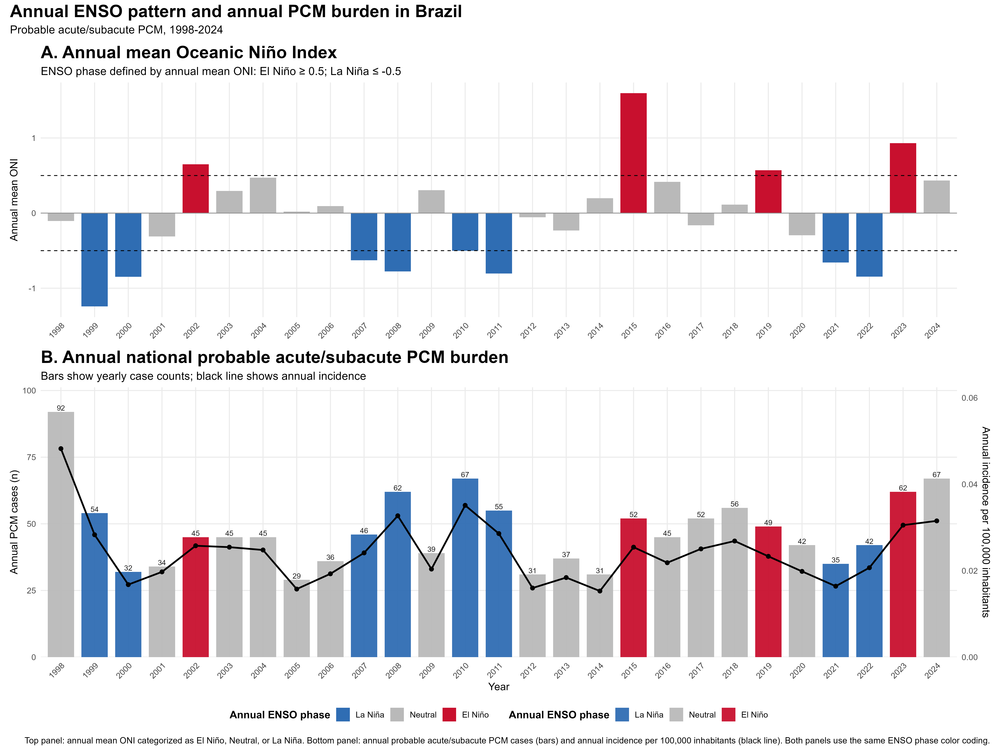
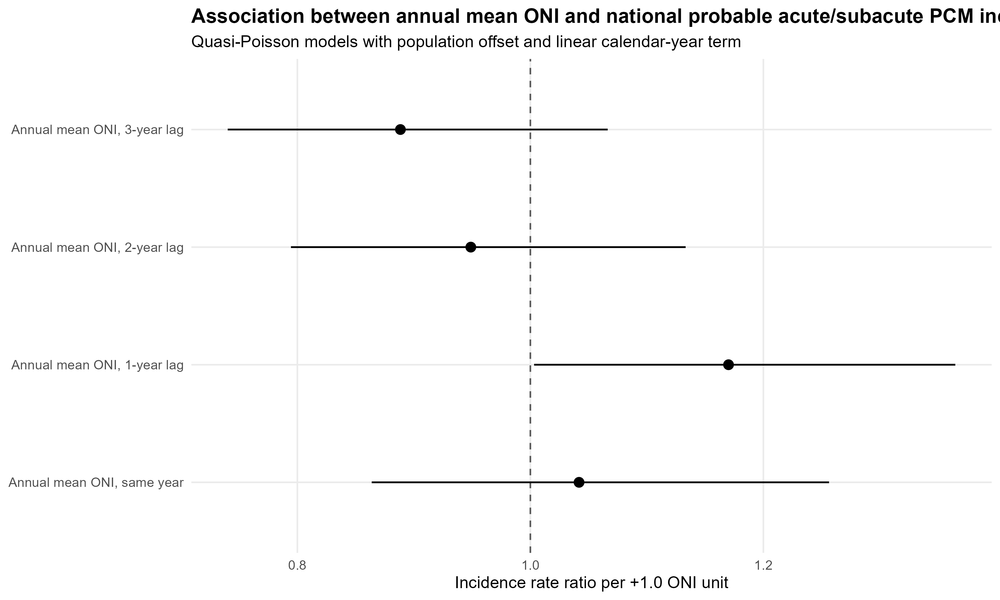
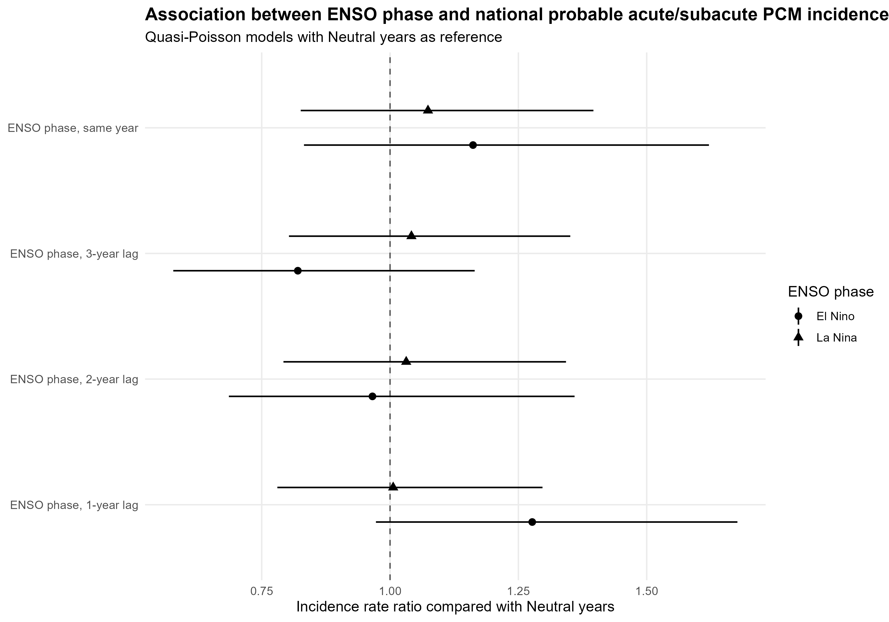
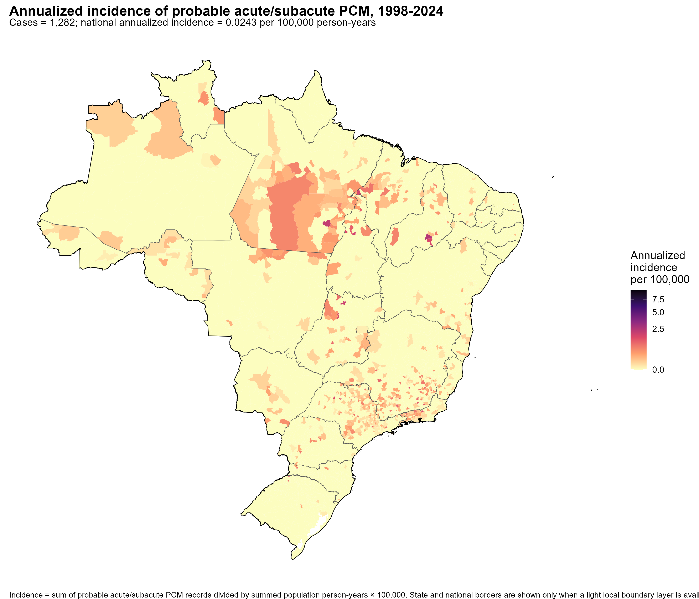
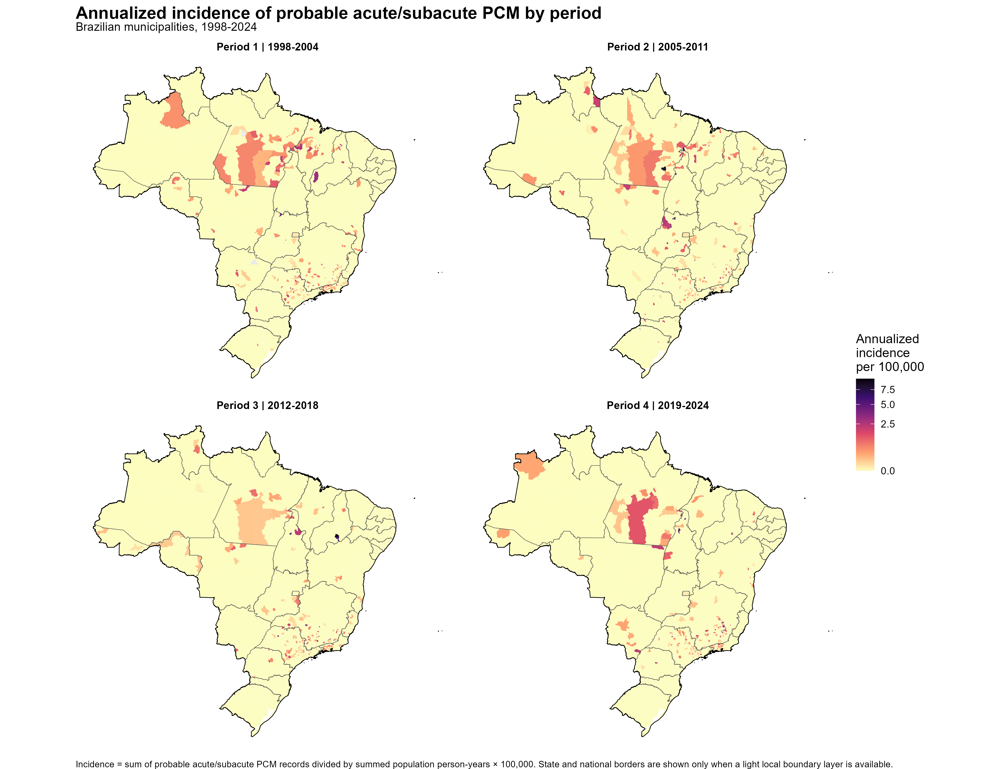

# ENSO and probable acute/subacute paracoccidioidomycosis in Brazil

This repository contains a reproducible analysis package for the exploratory evaluation of the relationship between the El Niño-Southern Oscillation (ENSO) and probable acute/subacute paracoccidioidomycosis (PCM) in Brazil, together with municipal incidence maps.

## Overview

- **Outcome:** probable acute/subacute PCM, defined using DATASUS records with ICD-10 code B41 and age <= 20 years.
- **Study period:** 1998-2024.
- **Spatial unit:** Brazilian municipalities.
- **Temporal exposure:** annual mean Oceanic Niño Index (ONI).
- **ENSO phase definition:** El Niño if annual mean ONI >= 0.5; La Niña if annual mean ONI <= -0.5; Neutral otherwise.
- **Incidence metric:** records per 100,000 inhabitants or per 100,000 person-years, depending on the analysis level.

## Repository structure

```text
scripts/                 R scripts used to generate the analyses and figures
data/                    Lightweight processed data used by the analyses
tables/                  CSV tables generated by the analyses
figures/enso/            ENSO and annual PCM burden figures
figures/incidence_maps/  Municipal incidence maps
logs/                    Execution reports from validated scripts
docs/                    Data dictionary and methods note
```

## Main analyses

### 1. ENSO and annual national PCM burden

Annual PCM records were aggregated at the national level and linked to annual mean ONI. Because ENSO is a year-level exposure, the primary analysis was performed as an annual national time series rather than as independent municipality-year observations.

The annual analysis includes descriptive figures, phase-specific summaries, and exploratory regression models with population offsets and a linear calendar-year term.

### 2. Municipal incidence maps

Municipal annualized incidence was calculated as the total number of probable acute/subacute PCM records in each period divided by the summed municipal population person-years in the same period, multiplied by 100,000.

The mapped periods were:

- 1998-2024 overall
- 1998-2004
- 2005-2011
- 2012-2018
- 2019-2024

## Population denominator correction

The population denominator was corrected using the widest valid municipal population file identified in the project environment (`ibge_official_municipal_population_sources.rds`). Missing population rows were reduced from 85,791 to 60.

This correction was important because earlier restricted modeling datasets did not provide complete national population coverage.

## Key results

### Annual national PCM burden

Across 27 years (1998-2024), the national annual dataset included **1,282 probable acute/subacute PCM records**.

The mean annual number of records was **47.5** and the median was **45.0**.

The mean annual national incidence was **0.0243 per 100,000 inhabitants**, and the median annual incidence was **0.0241 per 100,000 inhabitants**.

The highest annual case count occurred in **1998** with **92 records**. The highest annual incidence occurred in **1998** with **0.0482 per 100,000 inhabitants**.

### ENSO phase summaries

| ENSO phase | Years | Total cases | Mean annual cases | Mean incidence/100,000 | Median incidence/100,000 |
| --- | --- | --- | --- | --- | --- |
| Neutral | 15 | 681 | 45.4000 | 0.0232 | 0.0204 |
| El Nino | 4 | 208 | 52.0000 | 0.0263 | 0.0256 |
| La Nina | 8 | 393 | 49.1000 | 0.0253 | 0.0262 |

### One-year lagged ENSO phase summaries

| Lagged ENSO phase | Years | Total cases | Mean annual cases | Mean incidence/100,000 | Median incidence/100,000 |
| --- | --- | --- | --- | --- | --- |
| Neutral | 14 | 634 | 45.3000 | 0.0231 | 0.0244 |
| El Nino | 5 | 291 | 58.2000 | 0.0294 | 0.0254 |
| La Nina | 8 | 357 | 44.6000 | 0.0232 | 0.0205 |

### Exploratory regression estimates

The regression estimates should be interpreted as exploratory because the annual time series has a limited number of observations. The most consistent signal was observed for warmer ENSO conditions in the previous year.

| Model | Family | IRR | 95% CI | p-value |
| --- | --- | --- | --- | --- |
| ONI, same year | Quasi-Poisson | 1.042 | 0.864-1.256 | 0.672 |
| ONI, 1-year lag | Quasi-Poisson | 1.170 | 1.003-1.365 | 0.057 |
| ONI, 1-year lag | Negative binomial | 1.165 | 1.008-1.347 | 0.039 |
| El Niño vs Neutral, same year | Quasi-Poisson | 1.162 | 0.832-1.621 | 0.388 |
| El Niño vs Neutral, 1-year lag | Quasi-Poisson | 1.277 | 0.972-1.677 | 0.092 |

### Municipal incidence by period

| Period | Municipalities | Municipalities with cases | Total cases | Person-years | National annualized incidence/100,000 | Maximum municipal incidence/100,000 |
| --- | --- | --- | --- | --- | --- | --- |
| Period 1 / 1998-2004 | 5,570 | 190 | 347 | 0 | 0.0272 | 4.0850 |
| Overall period / 1998-2024 | 5,570 | 538 | 1,282 | 0 | 0.0243 | 2.4470 |
| Period 2 / 2005-2011 | 5,570 | 193 | 334 | 0 | 0.0252 | 8.0300 |
| Period 3 / 2012-2018 | 5,570 | 183 | 304 | 0 | 0.0213 | 9.6200 |
| Period 4 / 2019-2024 | 5,570 | 164 | 297 | 0 | 0.0237 | 6.5920 |

## Figures

The figures below are the figures currently available in the package. If you manually remove or add PNG files in the `figures/` folder, rerunning this script will update this section automatically.

### Figure 1. Combined ENSO and PCM burden figure



This figure links the annual mean ONI classification with the annual number of probable acute/subacute PCM records and the annual national incidence. Bars are colored by ENSO phase, making it possible to compare PCM burden across El Niño, La Niña, and Neutral years.


### Figure 2. Incidence rate ratios for continuous ONI models



This figure summarizes exploratory regression estimates for the association between annual mean ONI and national PCM incidence using current and lagged ONI variables.


### Figure 3. Incidence rate ratios for ENSO phase models



This figure summarizes exploratory regression estimates comparing El Niño and La Niña years with Neutral years.


### Figure 4. Municipal annualized incidence, 1998-2024



This map shows the annualized municipal incidence of probable acute/subacute PCM for the full analytical period. Incidence is expressed per 100,000 person-years.


### Figure 5. Municipal annualized incidence by period



This panel compares annualized municipal incidence across the four analytical subperiods. The same color scale is used across panels to support visual comparison.


## Reproducibility

The main scripts are available in the `scripts/` folder:

- `24_analyze_enso_impact_on_pcm_incidence.R`: national annual ENSO analysis.
- `24b_create_pcm_incidence_period_maps.R`: municipal incidence maps.
- `24d_create_combined_oni_pcm_burden_figure.R`: combined ONI and PCM burden figure.

The main CSV outputs are available in the `tables/` folder. Execution reports are available in the `logs/` folder.

## Interpretation notes

- The acute/subacute classification is a surveillance proxy based on age <= 20 years and should not be interpreted as confirmed clinical form.
- Municipalities without records should not be interpreted as areas without risk. They may reflect low incidence, underdiagnosis, underreporting, or limited access to diagnosis.
- ENSO analyses are descriptive and exploratory. Formal causal interpretation is not warranted from this annual ecological time series.

## Data sharing note

This package intentionally avoids sharing raw individual-level DATASUS records. It includes aggregate processed tables, scripts, figures, and execution logs to support transparency and reproducibility.

## Suggested citation

Fava W. ENSO and probable acute/subacute paracoccidioidomycosis in Brazil: reproducible analysis package. GitHub repository.

